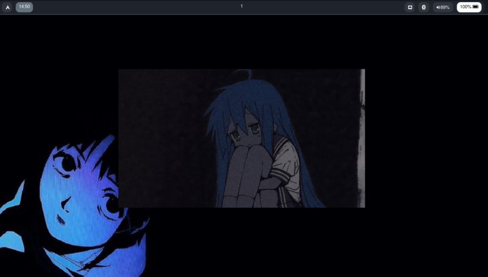

# niri-mi-config

Configuración personalizada de Niri, un compositor Wayland.

##  Instalación
1. Copiar `config.kdl` a `~/.config/niri/`
2. Copiar `rofi.sh` a `~/.config/niri/`
3. Copiar la carpeta `configs/` a `~/.config/niri/configs/`
4. Reiniciar niri
